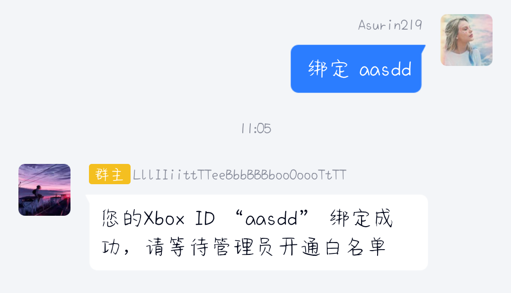
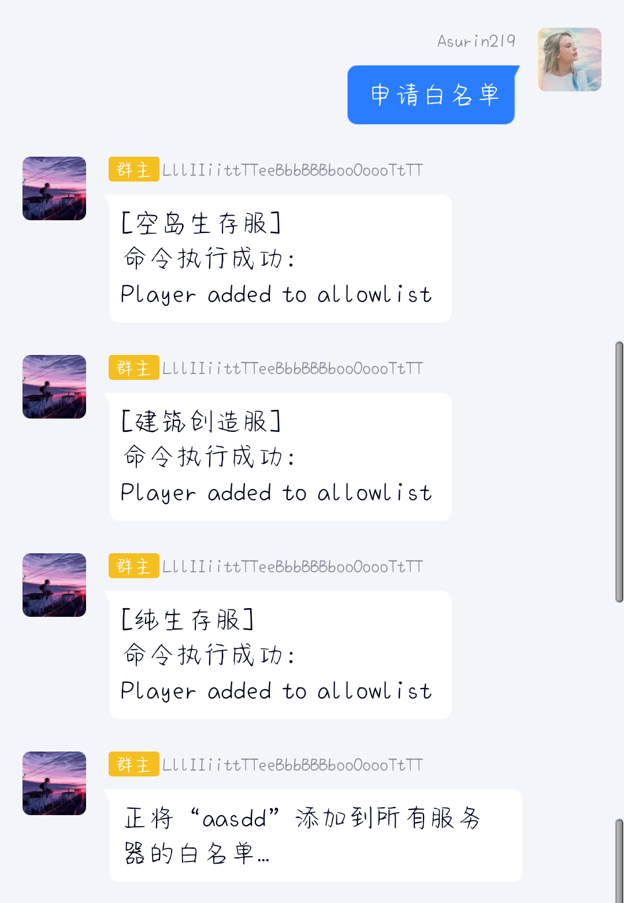
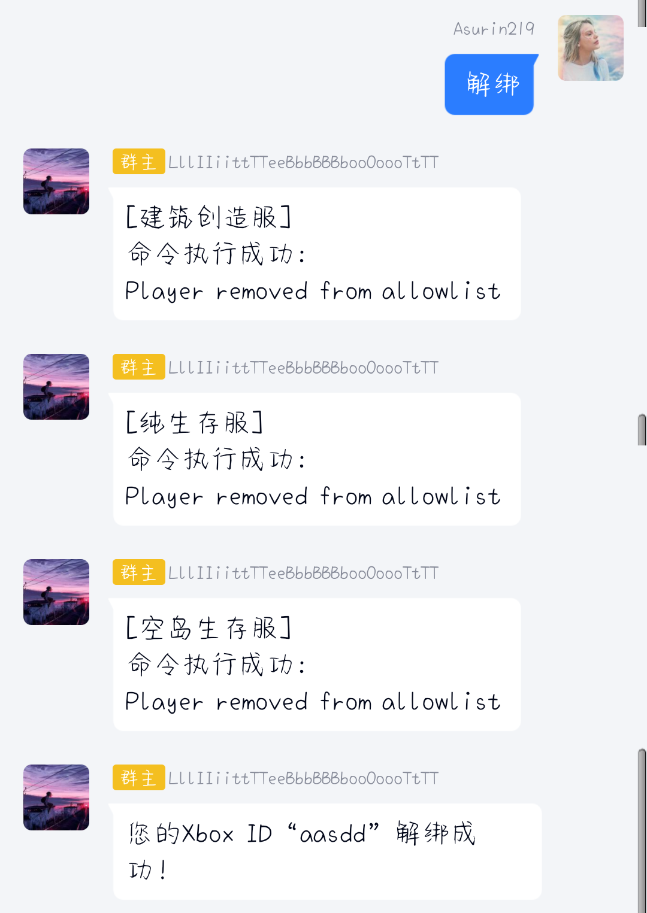
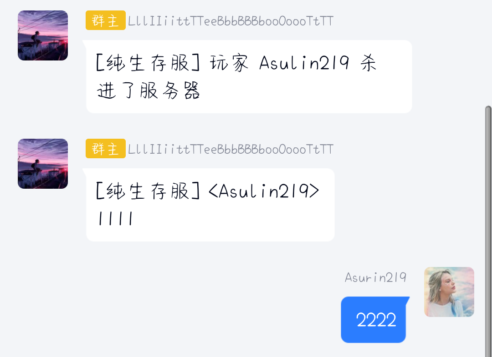
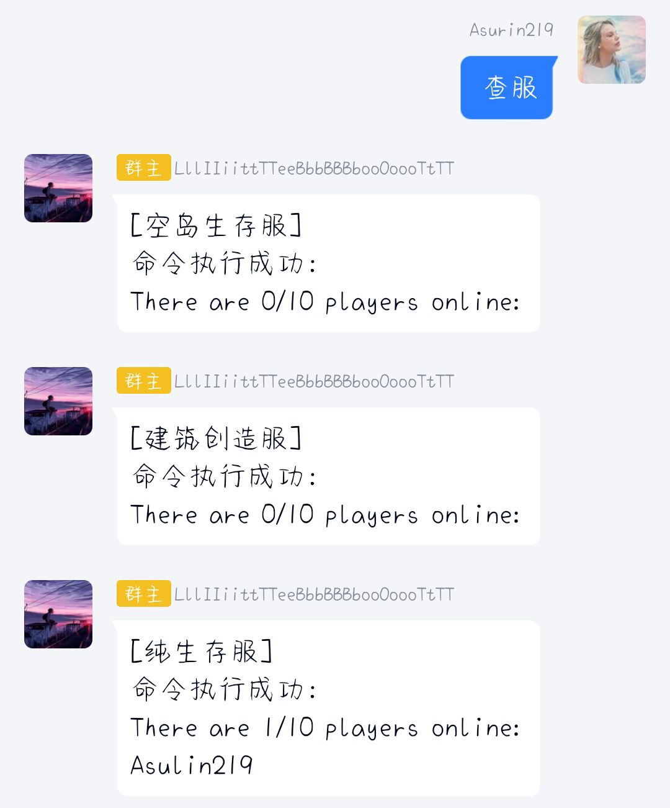

## 前言：为什么需要群组服机器人

为了让 QQ 群与基岩版服务器之间的信息能够实现互联互通，群服互通的概念应运而生。群服互通需要处理的内容包括聊天消息、以及服务器控制指令等。

群组服机器人

## 关于 LiteBot

**LiteBot** 是一个基于 Node.js 平台、[OICQ](https://github.com/takayama-lily/oicq)框架进行开发的群组服机器人，旨在解放服主和管理员的双手，令服主和管理员能够专注于服务器的规划与建设，而不需要频繁处理服务器和群内琐碎的事务，有效降低服务器、群聊的维护工作量。

自 3.0 版本伊始，LiteBot 正式支持多群多服，并初步实现了插件加载，旨在为广大开发者提供开放的平台，便于开发者对机器人的功能进行扩展。

## 特性

- 📱 n+n 群组服互通
- 📋 流程自助化，真正解放服主的双手
- 🎨 高度定制化，超过 60%的功能支持自定义
- 📋 使用 SQLite3 轻量级数据库存储数据，灵活性更高
- 🏷 提供数量众多的 API，扩展能力强（开发 ing）
- 📦 开箱即用，无需进行复杂的配置

## 功能示例

 
 
 
 
 
 
