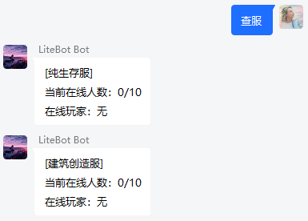
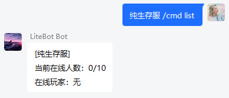
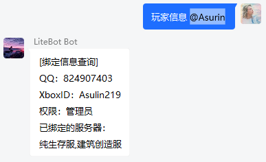

# 高级配置

## 正则表达式

- 位置：`./config/regex.json`
  LiteBot 可通过正则表达式模块对群消息进行特定处理。当群内发送的消息与正则表达式匹配时，将会触发相应的动作。

示例配置：

```json
[
  {
    //正则组1
    "regex": "^(绑定 )([A-Za-z0-9 ]{4,20})$", //正则表达式
    "permission": 1, //执行该组动作的所需权限，0为普通玩家，1为管理员
    "actions": [
      //动作组，即正则匹配成功时所执行的动作
      {
        //动作1
        "type": "bind_xboxid" //动作类型
      },
      {
        //动作2
        "type": "add_allowlist_self"
      }
    ]
  },
  {
    //正则组2...
  }
]
```

以下是正则表达式的配置项：

| regex（正则表达式）              | type（动作类型）   | content（内容） | 说明                                    | 使用效果                                                                                                                                                  |
| -------------------------------- | ------------------ | --------------- | --------------------------------------- | --------------------------------------------------------------------------------------------------------------------------------------------------------- |
| "^(帮助)\$"                      | group_msg          | "帮助测试"      | 发送一条自定义内容的群消息"帮助测试"    |                                                                               |
| "^(.+ \|)(查服\$)"               | run_cmd            | "/list"         | 向服务器执行一条预定的控制台指令"/list" |   |
| "^(.+ \|)(/cmd )(.+\$)"          | run_cmd_raw        | -               | 向服务器执行一条自定义的控制台指令      |   |
| "^(绑定 )([A-Za-z0-9 ]{4,20})\$" | bind_xboxid        | -               | 自助绑定白名单                          |                                                                               |
| "^(申请白名单)\$"                | add_allowlist_self | -               | 自助添加白名单                          |                                                                               |
| "^(我的信息)\$"                  | get_bind_info_self | -               | 查询本人的白名单绑定状态                |                                                                               |
| "^(解绑)\$"                      | del_allowlist_self | -               | 自助解绑白名单                          |                                                                               |
| "^(加白名单)(.+\$)"              | add_allowlist      | -               | 为目标玩家添加白名单                    |                                                                               |
| "^(查绑定 )(.+\$)"               | get_bind_info      | -               | 查询目标玩家的白名单绑定状态            |                                                                               |
| "^(解绑 )(.+\$)"                 | del_allowlist      | -               | 删除目标玩家的白名单                    |                                                                               |

## 语言配置

- 位置：`./config/lang.json`
  当相关的动作或事件触发时（例如玩家加入/离开服务器、管理员在群内执行指令等），LiteBot 将会根据语言配置配置，向群内发送经格式化处理后的文本消息（一般是动作的执行结果、服务器内的聊天信息等）。
  以下是配置说明：

| 配置项                               | 说明                                   | 支持的占位符                                                                                                                   | 示例配置                                                                                                |
| ------------------------------------ | -------------------------------------- | ------------------------------------------------------------------------------------------------------------------------------ | ------------------------------------------------------------------------------------------------------- |
| "player_chat"                        | 玩家在服内聊天（转发到绑定的群聊）     | `{server_name}` : 服务器名称<br>`{player}` : 玩家 XboxID<br>`{content}` : 玩家聊天内容                                         | "§b\[{group_name}\] §a<{group_sender}>§r {content}"                                                     |
| "chat_between_server"                | 玩家在服内聊天（转发到其他服务器）     | `{server_name}` : 服务器名称<br>`{player}` : 玩家 XboxID<br>`{content}` : 玩家聊天内容                                         | "§9[{server_name}] §6<{player}>§r {content}"                                                            |
| "server_does_not_exist"              | 服务器不存在                           | `{server_name}` : 服务器名称                                                                                                   | "没有名为“{server_name}”的服务器"                                                                       |
| "permission_denied"                  | 玩家无权执行相关操作                   | -                                                                                                                              | "权限不足，拒绝执行"                                                                                    |
| "server_offline"                     | 服务器离线                             | `{server_name}` : 服务器名称                                                                                                   | "\[{server_name}\]\n 服务器已离线"                                                                      |
| "server_connect_error"               | 执行指令或相关操作时遇到服务器连接错误 | -                                                                                                                              | "\[{server_name}\]\n 服务器未启用，或遇到其他错误"                                                      |
| "get_bind_info"                      | 获取玩家绑定状态                       | `{qqid}` : 已绑定的 QQ 账号<br>`{XboxID}` : 已绑定的 XboxID<br>`{permission}` : 玩家权限<br>`{bind_status}` : 服务器白名单状态 | "\[绑定信息查询\]\nQQ：{qqid}\nXboxID：{xboxid}\n 权限：{permission}\n 已绑定的服务器：\n{bind_status}" |
| "member_bind_succeeded"              | 玩家绑定成功                           | `{XboxID}` : 玩家绑定的 XboxID                                                                                                 | "您的 Xbox ID “{xboxid}” 绑定成功，请等待管理员开通白名单"                                              |
| "member_unbind_succeeded"            | 玩家解绑成功                           | `{XboxID}` : 玩家绑定的 XboxID                                                                                                 | "您的 Xbox ID“{xboxid}”解绑成功！"                                                                      |
| "member_already_binded"              | 玩家已经绑定过了                       | -                                                                                                                              | "您已经绑定过了，请勿重复绑定！"                                                                        |
| "member_already_binded_by_others"    | 玩家需要绑定的 XboxID 已被其他玩家占用 | `{others_qqid}` : XboxID 占用者的 QQ 号                                                                                        | "该 XboxID“{xboxid}”已被 {others_qqid} 绑定，请联系管理员解决！"                                        |
| "member_not_bind"                    | 玩家未绑定                             | -                                                                                                                              | "您还没有绑定！"                                                                                        |
| "adding_to_allowlist"                | 正在将玩家的 XboxID 添加到服务器白名单 | `{XboxID}` : 玩家绑定的 XboxID                                                                                                 | "正将“{xboxid}”添加到所有服务器的白名单..."                                                             |
| "member_already_in_allowlist"        | 玩家的 XboxID 已经在服务器白名单内     | -                                                                                                                              | "您已经添加过白名单了！"                                                                                |
| "target_member_not_bind"             | 目标玩家未绑定                         | `{qqid}` : 操作的目标玩家的 QQ 号码                                                                                            | "目标“{qqid}”尚未绑定！"                                                                                |
| "target_member_already_in_allowlist" | 目标玩家的 XboxID 已经在服务器白名单内 | `{XboxID}` : 目标玩家绑定的 XboxID                                                                                             | "目标“{xboxid}”已经添加过白名单了！"                                                                    |
| "target_member_unbind_succeeded"     | 目标玩家解绑成功                       | `{XboxID}` : 目标玩家绑定的 XboxID<br>`{qqid}` : 目标玩家的 QQ 号                                                              | "已解除“{xboxid}（QQ:{qqid}）”的绑定，准备删除服务器白名单..."                                          |
