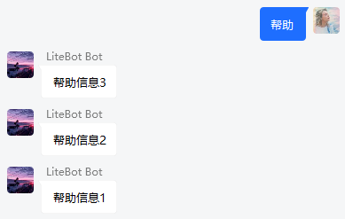
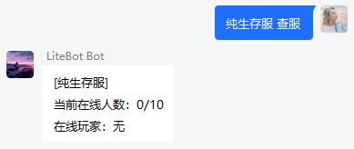
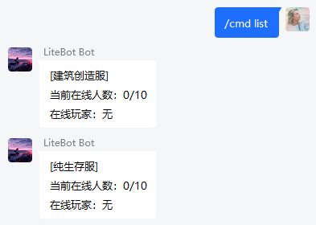
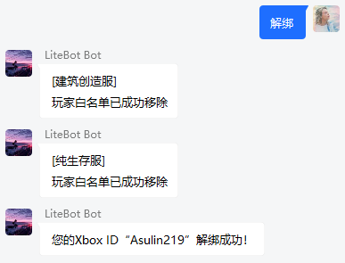
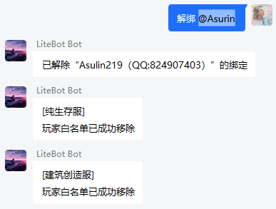

# 高级配置

## 正则表达式

- 位置：`./config/regex.json`

  LiteBot 可通过正则表达式模块对群消息进行特定处理。当群内发送的消息与正则表达式匹配时，将会触发相应的动作。示例配置如下：

  ```json
  [
    {
      //正则组1
      "regex": "^(绑定 )([A-Za-z0-9 ]{4,20})$", //正则表达式
      "permission": 1, //执行该组动作的所需权限，0为普通玩家，1为管理员
      "actions": [
        //动作组，即正则匹配成功时所执行的动作
        {
          //动作1
          "type": "bind_xboxid" //动作类型
        },
        {
          //动作2
          "type": "add_allowlist_self"
        }
      ]
    },
    {
      //正则组2...
    }
  ]
  ```

  以下是正则表达式的配置项和相关说明：

  | regex（正则表达式）              | type（动作类型）   | content（内容） | 说明                                    | 使用示例                                                                                                                                                  |
  | -------------------------------- | ------------------ | --------------- | --------------------------------------- | --------------------------------------------------------------------------------------------------------------------------------------------------------- |
  | "^(帮助)\$"                      | group_msg          | "帮助测试"      | 发送一条自定义内容的群消息"帮助测试"    |                                                                               |
  | "^(.+ \|)(查服\$)"               | run_cmd            | "/list"         | 向服务器执行一条预定的控制台指令"/list" |   |
  | "^(.+ \|)(/cmd )(.+\$)"          | run_cmd_raw        | -               | 向服务器执行一条自定义的控制台指令      |   |
  | "^(绑定 )([A-Za-z0-9 ]{4,20})\$" | bind_xboxid        | -               | 自助绑定白名单                          |                                                                               |
  | "^(申请白名单)\$"                | add_allowlist_self | -               | 自助添加白名单                          |                                                                               |
  | "^(我的信息)\$"                  | get_bind_info_self | -               | 查询本人的白名单绑定状态                |                                                                               |
  | "^(解绑)\$"                      | del_allowlist_self | -               | 自助解绑白名单                          |                                                                               |
  | "^(加白名单)(.+\$)"              | add_allowlist      | -               | 为目标玩家添加白名单                    |                                                                               |
  | "^(查绑定 )(.+\$)"               | get_bind_info      | -               | 查询目标玩家的白名单绑定状态            |                                                                               |
  | "^(解绑 )(.+\$)"                 | del_allowlist      | -               | 删除目标玩家的白名单                    |                                                                               |
  | "^(.+ \|)(/chat )(.+\$)"         | chat_to_server     | -               | 发送聊天消息到服务器                    |                                                                               |

## 语言格式配置

- 位置：`./config/lang.json`

  当相关的动作或事件触发时（例如玩家加入/离开服务器、管理员在群内执行指令等），LiteBot 将会根据语言格式配置，向群内发送经格式化处理后的文本消息。

  ### "message_prefix"

  - 全局消息前缀（转发到群聊/服务器）

    | 配置项              | 说明                             | 支持的占位符                 | 示例配置               |
    | ------------------- | -------------------------------- | ---------------------------- | ---------------------- |
    | "groups->servers"   | 群消息转发至服务器的前缀         | `{group_name}` :群聊名称     | "§b[{group_name}]§r "  |
    | "servers->groups"   | 服务器消息转发至群聊的前缀       | `{server_name}` : 服务器名称 | "[{server_name}] "     |
    | "servers<->servers" | 服务器消息转发至其他服务器的前缀 | `{server_name}` : 服务器名称 | "§9[{server_name}]§r " |

  ### "chat_format"

  - 聊天消息格式（转发到群聊/服务器）

    | 配置项              | 说明                             | 支持的占位符                                                      | 示例配置                         |
    | ------------------- | -------------------------------- | ----------------------------------------------------------------- | -------------------------------- |
    | "groups->servers"   | 群消息转发至服务器的前缀格式     | `{group_member}` :群成员名称<br>`{content}` : 群成员聊天消息内容  | "§a<{group_member}>§r {content}" |
    | "servers->groups"   | 服务器消息转发至群聊的格式       | `{player}` : 玩家 XboxID<br>`{content}` : 玩家服务器聊天消息内容  | "<{player}>\n{content}"          |
    | "servers<->servers" | 服务器消息转发至其他服务器的格式 | `{player}` : 玩家 XboxID<br/>`{content}` : 玩家服务器聊天消息内容 | "§6<{player}>§r {content}"       |

  ### "group_message_reply"

  - 机器人回复消息格式

    | 配置项                               | 说明                                   | 支持的占位符                                                                                                                   | 示例配置                                                                                                |
    | ------------------------------------ | -------------------------------------- | ------------------------------------------------------------------------------------------------------------------------------ | ------------------------------------------------------------------------------------------------------- |
    | "server_does_not_exist"              | 服务器不存在                           | `{server_name}` : 服务器名称                                                                                                   | "没有名为“{server_name}”的服务器"                                                                       |
    | "permission_denied"                  | 玩家无权执行相关操作                   | -                                                                                                                              | "权限不足，拒绝执行"                                                                                    |
    | "server_offline"                     | 服务器离线                             | `{server_name}` : 服务器名称                                                                                                   | "\[{server_name}\]\n 服务器已离线"                                                                      |
    | "server_connect_error"               | 执行相关操作时遇到服务器连接错误       | -                                                                                                                              | "\[{server_name}\]\n 服务器未启用，或遇到其他错误"                                                      |
    | "get_bind_info"                      | 获取玩家绑定状态                       | `{qqid}` : 已绑定的 QQ 账号<br>`{xboxid}` : 已绑定的 XboxID<br>`{permission}` : 玩家权限<br>`{bind_status}` : 服务器白名单状态 | "\[绑定信息查询\]\nQQ：{qqid}\nXboxID：{xboxid}\n 权限：{permission}\n 已绑定的服务器：\n{bind_status}" |
    | "member_bind_succeeded"              | 玩家绑定成功                           | `{XboxID}` : 玩家绑定的 XboxID                                                                                                 | "您的 Xbox ID “{xboxid}” 绑定成功，请等待管理员开通白名单"                                              |
    | "member_unbind_succeeded"            | 玩家解绑成功                           | `{xboxid}` : 玩家绑定的 XboxID                                                                                                 | "您的 Xbox ID“{xboxid}”解绑成功！"                                                                      |
    | "member_already_binded"              | 玩家已经绑定过了                       | -                                                                                                                              | "您已经绑定过了，请勿重复绑定！"                                                                        |
    | "member_already_binded_by_others"    | 玩家需要绑定的 XboxID 已被其他玩家占用 | `{others_qqid}` : XboxID 占用者的 QQ 号                                                                                        | "该 XboxID“{xboxid}”已被 {others_qqid} 绑定，请联系管理员解决！"                                        |
    | "member_not_bind"                    | 玩家未绑定                             | -                                                                                                                              | "您还没有绑定！"                                                                                        |
    | "adding_to_allowlist"                | 正在将玩家的 XboxID 添加到服务器白名单 | `{xboxid}` : 玩家绑定的 XboxID                                                                                                 | "正将“{xboxid}”添加到所有服务器的白名单..."                                                             |
    | "member_already_in_allowlist"        | 玩家的 XboxID 已经在服务器白名单内     | -                                                                                                                              | "您已经添加过白名单了！"                                                                                |
    | "target_member_not_bind"             | 目标玩家未绑定                         | `{qqid}` : 操作的目标玩家的 QQ 号码                                                                                            | "目标“{qqid}”尚未绑定！"                                                                                |
    | "target_member_already_in_allowlist" | 目标玩家的 XboxID 已经在服务器白名单内 | `{xboxid}` : 目标玩家绑定的 XboxID                                                                                             | "目标“{xboxid}”已经添加过白名单了！"                                                                    |
    | "target_member_unbind_succeeded"     | 目标玩家解绑成功                       | `{xboxid}` : 目标玩家绑定的 XboxID<br>`{qqid}` : 目标玩家的 QQ 号                                                              | "已解除“{xboxid}（QQ:{qqid}）”的绑定，准备删除服务器白名单..."                                          |

  ### "join_or_leave_from_servers"

  - 玩家进入/离开服务器消息格式（转发到群聊/服务器）

    | 配置项        | 说明           | 支持的占位符                 | 示例配置                        |
    | ------------- | -------------- | ---------------------------- | ------------------------------- |
    | "player_join" | 玩家进入服务器 | `{player}` : 玩家 XboxID<br> | "§e 玩家 {player} 杀进了服务器" |
    | "player_left" | 玩家离开服务器 | `{player}` : 玩家 XboxID<br> | "§e 玩家 {player} 爬出了服务器" |

  ### "runcmd_feedback"

  - 群内执行指令的反馈消息格式（转发到群聊）

    | 配置项                          | 说明                             | 支持的占位符                                                                           | 示例配置                                                                       |
    | ------------------------------- | -------------------------------- | -------------------------------------------------------------------------------------- | ------------------------------------------------------------------------------ |
    | "default"                       | 默认反馈（匹配不到配置项时显示） | `{result} : 指令执行结果 | "\n{result}"                                                |
    | "get_online_players"            | 服务器在线人数                   | `{online}` : 当前在线人数<br>`{max_online}` : 最大在线人数<br>`{players}` : 在线的玩家 | "\n 当前在线人数：{online}\n 最大在线人数：{max_online}\n 在线玩家：{players}" |
    | "No targets matched selector"   | 没有匹配的目标                   | `{server_name}` : 服务器名称                                                           | "\n 没有匹配的目标"                                                            |
    | "Player added to allowlist"     | 玩家已成功添加到白名单           | -                                                                                      | "\n 玩家已成功添加到白名单"                                                    |
    | "Player already in allowlist"   | 玩家已经添加过白名单了           |                                                                                        | "\n 玩家已经添加过白名单了"                                                    |
    | "Player removed from allowlist" | 玩家已从白名单中移除             |                                                                                        | "\n 玩家已从白名单中移除"                                                      |
    | "Player not in allowlist"       | 玩家未在白名单内                 |                                                                                        | "\n 玩家未在白名单内"                                                          |

  ### "player_die"

  - 玩家在游戏内的死亡消息格式（转发到群聊）

    | 配置项        | 说明                               | 支持的占位符                                             | 示例配置                                            |
    | ------------- | ---------------------------------- | -------------------------------------------------------- | --------------------------------------------------- |
    | "player_chat" | 玩家在服内聊天（转发到绑定的群聊） | `{player}` : 玩家 XboxID<br>`{src}` : 伤害源（可能为空） | "§b\[{group_name}\] §a<{group_sender}>§r {content}" |
