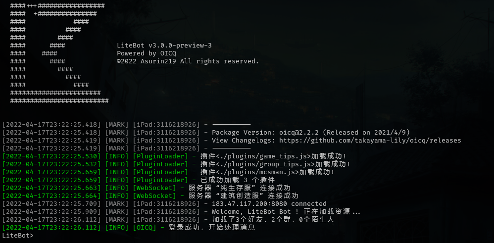

## 配置 LLWebSocket

### 组件准备

LiteBot 目前支持的 WebSocket 组件为：

| WebSocket 组件                                                                          | 组件类型 | 依赖平台      | 作者      |
| --------------------------------------------------------------------------------------- | -------- | ------------- | --------- |
| [LLWebSocket](https://www.minebbs.com/resources/c-bdx-liteloader-bdswebsocketapi.2150/) | 服务器   | LiteLoaderBDS | WangYneos |

### 开始配置

1、按照 LLWebSocket 文档指示，下载并将 LLWebSocket 插件添加到您的 BDS；
2、修改 LLWebSocket 配置文件：

```json
{
  "wsaddr": "0.0.0.0:996", //务必按照“IP地址:端口”的格式进行填写，IP地址一般写0.0.0.0（即监听本机所有IP地址）
  "endpoint": "/mc", //可自定义，务必带前缀“/”
  "encrypt": "aes_cbc_pkcs7padding", //务必修改为“aes_cbc_pkcs7padding”
  "wspasswd": "32v34W#e6%E*6wv$^Vw?65a+",
  "enableLog": false
}
```

3、开服，然后开始配置 LiteBot

## 配置 LiteBot

### 组件准备

### 开始配置

#### 对于 Windows 用户

1. 下载 LiteBot；
2. 将压缩包内的所有文件解压，进入解压后的文件夹，复制 examples 文件夹并重命名为 config；
3. 打开 LiteBot 全局配置文件`./config/global_config.yml`，按照文件内的提示进行修改；
4. 修改完成后,保存并退出。

#### 对于 Linux 用户

1. 在终端输入以下命令，执行快速初始化:

```bash
wget -qO- https://gitee.com/litebot/litebot-scripts/raw/master/init.sh | bash
```

2. 初始化完成后，进入 LiteBot 根目录（位置：`/opt/LiteBot`）；
3. 打开 LiteBot 全局配置文件`./config/global_config.yml`，按照文件内的提示进行修改；
4. 修改完成后,保存并退出。

### 运行 LiteBot

在 LiteBot 根目录打开终端，输入以下命令启动 LiteBot：

```bash
node app.js
```

当控制台出现以下类似的内容时，说明 LiteBot 已经可以正常使用：

</br>
